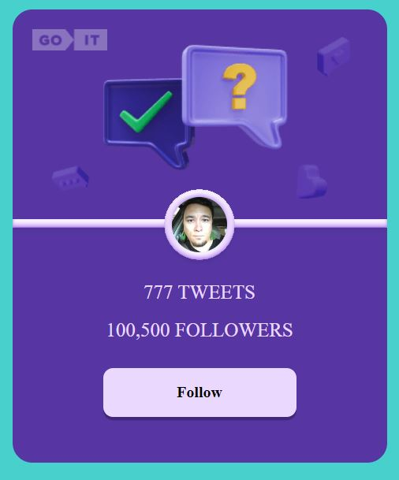
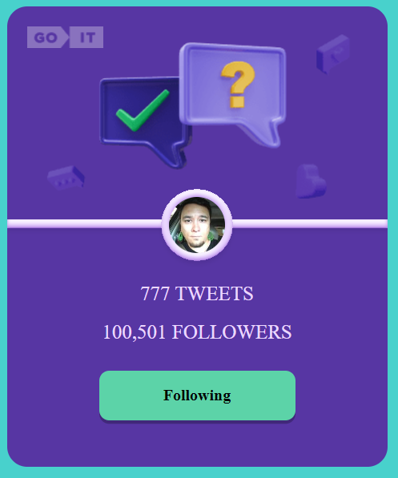

## Приложение - карточка пользователя твиттера.

1. Создан макет одной карточки пользователя твиттера согласно ТЗ

Mакет одной карточки пользователя твиттера:

2. При клике на кнопку FOLLOW её текст изменяется на FOLLOWING, и цвет фона меняется с белого на зеленый. А количество фоловеров увеличивается на 1. Т. е., если первоначальное количество составляло 100,500 фоловеров, то после нажатия на кнопку оно будет составлять 100,501 фоловеров.

3. Результат фиксируется и после перезагрузки страницы отображается последнее
   состояние карточки до перезагрузки, т. е. кнопка будет иметь зеленый цвет
   фона с надписью FOLLOWING, а количество фоловеров будет равно 100,501:

4. При повторном нажатии на кнопку состоянии каточки возвращается к
   первоначальному. Кнопка снова будет иметь белый цвет фона с надписью FOLLOW,
   а количество фоловеров снова будет равно 100,500.

5. При нажатии на кнопку Load More подгружается еще 9 карточок с новими пользователями.

